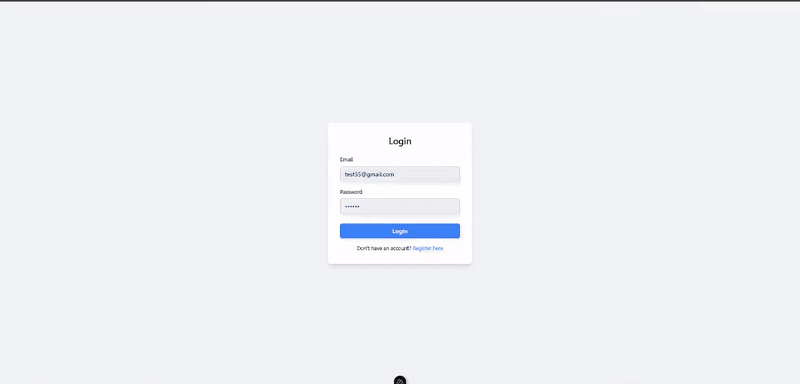

# Products reviewed project

## Description

Review a Product is a platform where users can discover, discuss, and review new
products. The goal of this project is to enable users to rate and search for
products as well as interact through ratings and comments.

## Technologies

### Back-end

The project was built using Node.js + Adonis.JS (latest realeased versions until
01/10/2025) with MySQL as the database; There is also an integration with
cloudinary. To this feature work, it's necessary to get the variables from your
own cloudinary account.

### Front-end

The project was built using Vue.js with NuxtJS (v3.15)

## How to start the project

### Back-end

To start the back-end project, it is recommended to use Docker, as it is already
configured with the API. After setting up Docker, please run the following
commands:

```
cd back-end
```

```
cp .env.example .env
```

One of the variables need to be set manually, please use the following command:

```
docker inspect -f '{{range .NetworkSettings.Networks}}{{.IPAddress}}{{end}}' adonis_database
```

Change the variable

```
DB_HOST = output from the previous command (Example: 192.168.0.2)
```

```
docker-compose up --build -d
```

The project will be accessible at:

```
http://localhost:9229/
```

There is a JSON collection available for import into Postman that have all
endpoints with examples

### Front-end

To start the front-end project, it's necessary to have the node version > 20.
Then, run the following commands:

```
cd front-end
```

```
cp .env.example .env
```

```
npm install
```

```
npm run dev
```

The project will be accessible at:

```
http://localhost:3000/
```

## Demo Project



## Features

### Front-End (with Nuxt.js)

1. **Registration Page**:

   - A form to register new users.

2. **Login Page**:

   - A form for user authentication.

3. **Product Listing Page**:

   - Displays a list of products available in the database.
   - Shows basic information such as title, image, category and a short
     description.

4. **Product Addition Modal**:

   - A form where just admin users can publish a new product.
   - The form collects information such as product title, description, image,
     and category.
   - Validation of these fields;
   - After submission, the product is added to the database.

5. **Product Details Page**:

   - Displays complete information about a product, including title, image,
     description, and category.
   - Shows a list of user reviews.
   - Allows users to add a new review with a rating (stars) and a comment (Just
     one per user).
   - There is a button to Update the product and delete the product (Deleting
     the product will delete all comments as well)

6. **Rating System (Inside the product details page)**:
   - Allows users to add star-based ratings for each product.
   - Displays the average rating on the product details page.

---

### Back-End (with Adonis.js)

#### Tables

- **users**: `name`, `email`, `password`, `is_admin`
- **products**: `name`, `description`, `image`, `category`
- **reviews**: `product_id`, `user_id`, `rating`, `comment`  
  _(Note: Each user can leave only one review per product)_

#### Endpoints

_(Note: Check JSON Postman collection for more info about the endpoints)_

1. **CRUD for Users**:
   - Includes login functionality.
2. **CRUD for Products**:

   - Create, read, update, and delete product data.

3. **Reviews**:
   - An endpoint to retrieve reviews for a specific product by its ID.
   - An endpoint to post a new review for a specifc product.
